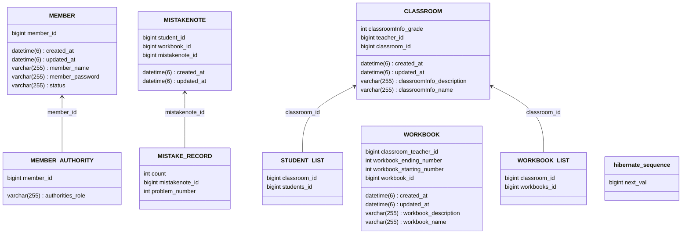

<h1>Oh!Dab</h1> 

수학학원 학생들의 오답관리 서비스

    
    
    
    
    

 

## Activity

## API 명세서
- [**명세서**](https://oh-dab.github.io/server-api/index.html)

## ERD 다이어그램

## 팀원
<table>
  <tbody>
    <tr>
      <td align="center" valign="top" width="5%"></td>
      <td align="center" valign="top" width="5%"></td>
      <td align="center" valign="top" width="5%"></td>
    </tr>
    <tr>
        <td align="center"><a href="https://github.com/oh-dab/server-api/pulls?q=is%3Apr+is%3Aclosed+assignee%3Asimhani1" title="Closed Pull Requests">심종한</a></td>
        <td align="center"><a href="https://github.com/oh-dab/server-api/pulls?q=is%3Apr+is%3Aclosed+assignee%3Alinirini" title="Closed Pull Requests">이예린</a></td>
        <td align="center"><a href="https://github.com/oh-dab/server-api/pulls?q=is%3Apr+is%3Aclosed+assignee%3AFixtar" title="Closed Pull Requests">황성하</a></td>
    </tr>
  </tbody>
</table>